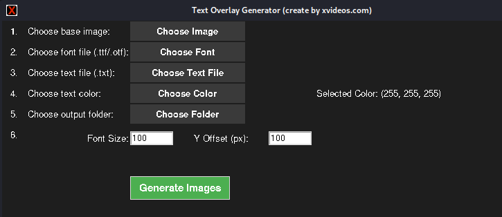
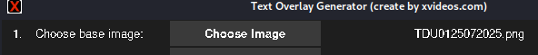
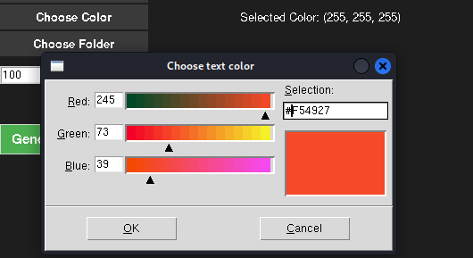
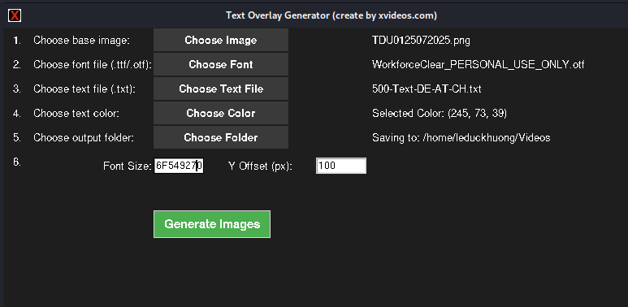
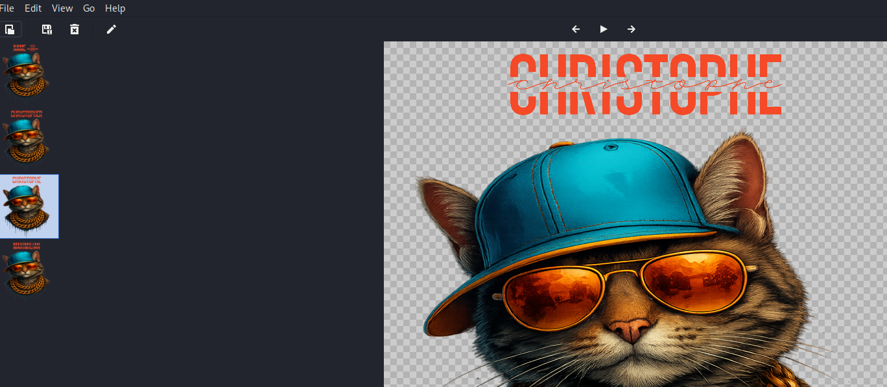

**overlayForImage** là một công cụ giúp bạn dễ dàng **đề chữ lên ảnh** theo danh sách từ có sẵn trong file `.txt`. Mỗi dòng trong file sẽ tạo ra một ảnh mới với chữ tương ứng được chèn vào vị trí mong muốn.

---

## ✅ Yêu cầu

- Python 3.6+
- `Pillow` (được cài qua `requirements.txt`)
- Môi trường có hỗ trợ `tkinter` (đa phần hệ thống đều có sẵn)

---

## ⚙️ Cài đặt

### Bước 1: Tải mã nguồn từ GitHub

```bash
git clone https://github.com/leduckhuong/overlayForImage.git
````

### Bước 2: Truy cập vào thư mục

```bash
cd overlayForImage
```

### Bước 3: Cài đặt thư viện cần thiết

```bash
pip install -r requirements.txt
```

### Bước 4: Chạy chương trình

```bash
python3 main.py
```

---

## 🚀 Hướng dẫn sử dụng

### Bước 1: Khởi động tool

```bash
python3 main.py
```

---

### Bước 2: Chọn ảnh nền

🖼️ *Mỗi từ sẽ được overlay lên ảnh này*



---

### Bước 3: Chọn font chữ (`.ttf` hoặc `.otf`)

🔤 *Bạn có thể sử dụng bất kỳ font nào mà hệ thống hỗ trợ*


---

### Bước 4: Chọn file `.txt`

📄 *Mỗi dòng là một dòng chữ sẽ overlay lên ảnh*


---

### Bước 5: Chọn màu chữ

🎨 *Sử dụng bảng màu trực quan*



---

### Bước 6: Chọn thư mục để lưu ảnh

📁 *Các ảnh sau khi overlay sẽ được lưu tại đây*


---

### Bước 7: Cài đặt cỡ chữ và vị trí chữ (tọa độ dọc - y-offset)

🧮 *Căn chỉnh vị trí đề chữ trên ảnh*


---

### Bước 8: Bấm `Generate Images` để bắt đầu

⚡ *Mỗi dòng chữ sẽ tạo ra một ảnh mới*



---

## 📂 Output

* Ảnh đầu ra được lưu trong thư mục bạn chọn.
* Tên file sẽ được tự động đánh số tương ứng với dòng chữ trong file `.txt`.

---

## 📌 Ghi chú

* Font chữ sử dụng nên hỗ trợ Unicode nếu bạn dùng tiếng Việt.
* Ảnh đầu vào hỗ trợ định dạng `.png`, `.jpg`, `.jpeg`, ...

---
